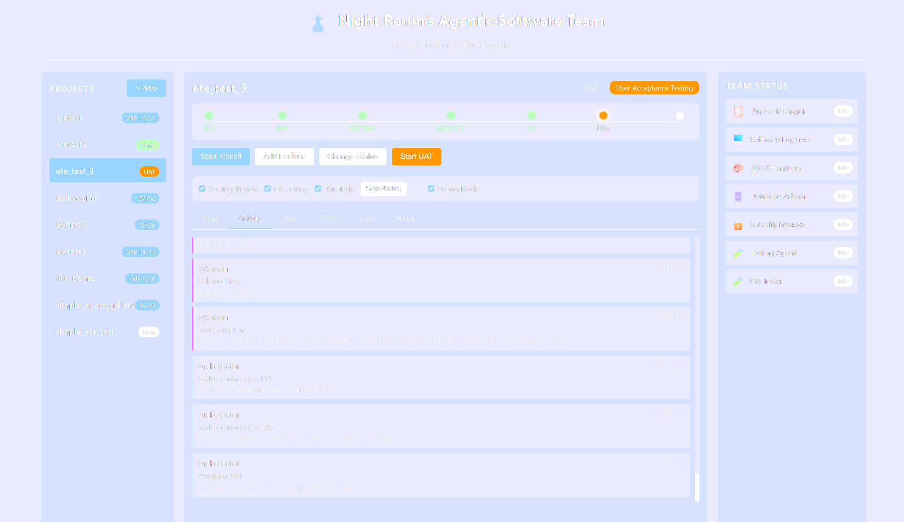

# Night Ronin's Agentic Software Team

**A fully autonomous AI development team that builds software for you.**


> **Experimental Software** — This project is under active development and provided as-is, with no warranties or guarantees. Use at your own risk.
>
> **How it works:** You describe what you want to build. A Project Manager agent asks clarifying questions, then generates a spec and task list. Specialized agents (engineers, DBA, security, QA) execute tasks in parallel, coordinating through shared project files. The system tracks progress, handles failures with retries, and guides you through final approval.
>
> **Known limitations:** Occasional unexplained timeouts and hangs occur, particularly during PM conversations. The system is built to handle this gracefully — conversation state is saved progressively, so if a process hangs, simply restart and it resumes where it left off. Task execution also supports auto-retry with error context.
>
> **Concurrency note:** This tool spawns multiple concurrent Claude Code CLI processes. While this does not violate Anthropic's Terms of Service, setting `max_concurrent_agents` too high may trigger rate limits. Use reasonable concurrency settings and monitor usage accordingly.



Describe what you want. Answer a few questions. Watch a team of specialized AI agents architect, implement, and deliver your project.

No API keys. No complex setup. Just your existing **Claude Code CLI subscription**.

---

## Why This Exists

You have Claude Code. It's powerful. But it's one agent doing everything.

This project gives you a **team** - specialized agents that collaborate, each focused on what they do best. A Project Manager gathers requirements. Engineers write code. A Security Reviewer catches vulnerabilities before they ship.

The result: better architecture, cleaner code, fewer blind spots.

---

## Features

### Specialized Agent Team

| Agent | Role |
|-------|------|
| **Project Manager** | Runs kickoffs, gathers requirements, creates specs and task lists |
| **Software Engineer** | Backend development, APIs, business logic, core implementation |
| **UI/UX Engineer** | Frontend, user interfaces, styling, user experience |
| **Database Admin** | Schema design, queries, migrations, data layer optimization |
| **Testing Agent** | Test creation and execution (before security review) |
| **Security Reviewer** | Security audits, vulnerability detection, code review |
| **QA Tester** | Automated QA passes (optionally via agent-browser) |

### Intelligent Task Management

- **Concise task breakdown** - AI generates minimal, meaningful tasks (not 200 micro-steps)
- **Parallel execution** - Multiple agents work simultaneously when tasks allow (cross-section optional)
- **Auto-retry with self-healing** - Failed tasks get retried with error context
- **Section-based organization** - Tasks grouped logically (Setup, Backend, Frontend, etc.)
- **Workflow statuses** - Project moves through WIP → Testing → Security Review → QA → UAT → Done
- **Test creation/update** - For `critical_paths` and `full_tdd`, a minimal language-appropriate test suite is created and updated (pytest only for Python)

### Token-Efficient Context

Each agent receives **minimal injected context** - just what it needs:
- Recent decisions (last 5)
- Sibling tasks in the current section only (max 3, uncompleted only)
- No spec dump, no completed tasks, no unrelated sections

With **session continuity** enabled, agents retain codebase knowledge from prior tasks — no re-reading files they already know. On resumed sessions, the agent definition (role, system prompt, boilerplate instructions) is **skipped entirely** since Claude already has it from the first turn. This keeps API costs low and agents focused.

### Context Window Management

The system tracks estimated context usage per agent session. When an agent approaches the configurable context window threshold (default 65%), its session is automatically reset so the next task starts a fresh conversation instead of hitting the context limit mid-task. Additionally, `max_tasks_per_session` (default 5) forces a session reset after a set number of tasks regardless of context usage, preventing gradual degradation. This is configured via the `context_window` section in `config.json`.

### Live Documentation Lookup

Agents can search for and fetch **current documentation** - not just training data:

```bash
# Agents use DuckDuckGo search to find docs
python utils/search_docs.py "prisma client api"
# Returns: https://www.prisma.io/docs/reference/api-reference/prisma-client-reference

# Then fetch and read the docs with WebFetch
```

No stale knowledge. No guessing at APIs. Current docs for whatever stack you choose.

### Built-in Safety

- **Blocked patterns** - Won't touch `.env`, credentials, API keys
- **Dangerous command detection** - No `rm -rf /` accidents
- **Secret scanning** - Catches hardcoded secrets in code
- **Security-first reviews** - Security issues block progress; style issues don't
- **QA review** - Automated QA pass after implementation (can be disabled)
- **UAT Launch Controls** - One-click launch/stop for your built project using runit.md, plus a launch log viewer

---

## Quick Start

### Prerequisites

- **Claude Code CLI** installed and authenticated ([get it here](https://claude.ai/code))
- **Python 3.10+**
- **uv** (recommended for venv management) - [install uv](https://docs.astral.sh/uv/getting-started/installation/)

### Install

```bash
git clone https://github.com/yourrepo/simple_agentic_software_team.git
cd simple_agentic_software_team

# Create a virtual environment (recommended)
uv venv --python 3.11
# Activate it:
#   Windows: .venv\Scripts\activate
#   Mac/Linux: source .venv/bin/activate

pip install -r requirements.txt
```

### Verify Claude CLI

```bash
claude --version
```

### Run

```bash
python main.py
```

Open [http://localhost:8080](http://localhost:8080) (default port, configurable via `server_port` in config.json)

---

## Usage

### Start a New Project

1. Click **+ New** in the sidebar
2. Name your project
3. (Optional) Check **Fast Project** to skip Testing, Security, and QA by default
3. Click **Start Kickoff**
4. Describe what you want to build
5. Answer the PM's questions (default 18 for projects, 10 for features)
6. Click **Write Spec** when ready
7. Click **Start Work** - agents take over
8. When prompted, click **Start UAT** to review and approve
9. Use **Launch** in UAT to run the project locally (uses `runit.md`)
10. Click **Stop** to terminate the launched process

### Add Features Later

1. Select your project
2. Click **Add Feature**
3. Describe the feature
4. Answer clarifying questions
5. Agents update the spec and implement

### Monitor Progress

- **Activity** - Real-time feed of what agents are doing
- **Spec** - Living project specification
- **TODO** - Task list with completion status
- **Team Status** - Which agents are currently working
- **Workflow Status** - WIP → Testing → Security Review → QA → UAT → Done

---

## Workflow Statuses

- **WIP** - Agents are implementing tasks from TODO.md
- **Security Review** - Security reviewer audits code (blocking issues reopen TODO)
- **Testing** - Testing agent creates/updates tests and runs them (when enabled)
- **QA** - QA tester verifies requirements and critical flows
- **UAT** - User acceptance testing with you in the UI
- **Done** - Approved in UAT

### UAT Launch & Logs

During UAT, use the **Launch** button to run the project in its own process. The system reads `runit.md` to find a run command and starts the app from the project directory. If `runit.md` does not include a clear run command block, launch will fail and the UI will prompt you to update it.

The **Stop** button terminates the launched process. If the project opened a browser tab via Launch, the UI will attempt to close it (browsers only allow closing tabs opened by the same UI session).

Use **Launch Log** to view the `launch.log` output captured from the launched process.

Example `runit.md` snippet:

```bash
# Install (if needed)
pip install -r requirements.txt

# Run (required for Launch)
python main.py
```

---

## How It Works

```
You describe project
       |
       v
  [Project Manager]
       |
  Asks 10-20 questions
       |
       v
  Creates SPEC.md + TODO.md
       |
       v
  [Orchestrator]
       |
  Routes tasks to specialists
       |
       +--> [Software Engineer] -- backend code
       |
       +--> [UI/UX Engineer] ----- frontend code
       |
       +--> [Database Admin] ----- schema, queries
       |
       +--> [Testing Agent] ----- builds/updates tests
       |
       +--> [Security Reviewer] -- audits everything
       |
       +--> [QA Tester] ---------- requirements verification
       |
       v
  UAT with you → Done
```

Workflow summary:

```
WIP → Testing → Security Review → QA → UAT → Done
```

### Agent Execution Model

Each agent runs as a **Claude Code CLI process** (`claude --print`):
- Specialized system prompt for its role
- Minimal, relevant context (recent decisions + sibling tasks)
- Full tool access (files, commands, web)
- Auto-selected model (Opus for complex, Sonnet for simple)
- **Prompts piped via stdin** — no Windows command-line length limits (previously capped at ~30K chars)

**Concurrency:** Each agent type has its own CLI session, but only `max_concurrent_agents` run at once (controlled by an asyncio semaphore). Setting this to 2 means two agents work in parallel; the rest queue.

**Session Continuity:** When `session_continuity` is enabled in config, agents reuse their Claude CLI session across tasks via `--resume <session_id>`. This eliminates cold-start overhead — the agent remembers the codebase, previous decisions, and files from earlier tasks. On resumed sessions, agent definitions (role context, system prompt, boilerplate instructions) are omitted from the prompt since Claude already has them. Sessions reset automatically when a new project or feature starts, when the CLI reports an error, or when context window usage exceeds the configured threshold. Disable with `"session_continuity": false` to revert to stateless mode.

**Context Window Tracking:** Each agent tracks cumulative chars sent/received in its session. When usage exceeds the `context_window.threshold_percent` (default 65%) of `context_window.max_chars`, the session is reset before the next task so the agent starts fresh instead of hitting the context limit mid-work. If the CLI returns token usage data, that is used for more accurate tracking. The `max_tasks_per_session` setting (default 5) provides a hard cap — after that many tasks, the session resets regardless of context usage. Set `max_chars` to `0` to disable tracking.

**Per-Agent Model Configuration:** Each agent can be configured with a specific model in the `agents` section of `config.json`. Set `"model": "opus"` to always use the powerful model, `"model": "sonnet"` for the fast model, or `"model": "auto"` to let model routing decide based on task complexity.

**Guardrails:** The `guardrails` section controls safety boundaries. `require_approval_for` and `blocked_operations` accept lists of operation patterns. `max_retries_before_escalation` (default 5) sets how many times a task can fail before escalating to the user.

**Debug Mode:** Set `debug.enabled` to `true` and `debug.stream_output` to `true` to see real-time CLI output from agents in the console. Useful for development and troubleshooting.

**Memory:** The `memory.max_action_log_entries` setting (default 10) controls how many recent action log entries are retained in working memory.

**CLI Options:** `cli.dangerously_skip_permissions` passes the `--dangerously-skip-permissions` flag to Claude CLI processes, bypassing tool permission prompts. This is required for fully autonomous operation but should be used with caution.

**UAT Questions:** `uat_questions` (default 100) controls the maximum number of questions during user acceptance testing.

**Stale File Detection:** When multiple agents work in parallel, Agent A may modify files that Agent B previously read in an earlier turn. On resumed sessions, the system scans the project for files modified since the agent's last task and injects a "Files Changed Since Your Last Task" warning into the prompt. This tells the agent to re-read those files before editing them, preventing overwrites of another agent's work. The scan is lightweight (mtime-based) and capped at 30 files to avoid bloating the prompt.

**Timeouts:** Timeouts are not retried (a timed-out prompt will almost certainly time out again). Exceptions are retried up to `max_task_retries` times with error context appended so the agent can adapt.

**Task Splitting:** Large tasks are automatically split into subtasks. Complexity is estimated from the clean task description (ignoring retry metadata) to avoid false positives.

---

## Configuration

Edit `config.json`:

```json
{
  "defaults": {
    "testing_strategy": "critical_paths",
    "review_policy": "tiered",
    "autonomy_level": "full"
  },
  "quality_gates": {
    "run_security_review": true,
    "run_qa_review": true,
    "run_tests": true
  },
  "playwright": {
    "enabled": true,
    "screenshot_dir": "QA"
  },
  "guardrails": {
    "require_approval_for": [],
    "blocked_operations": [],
    "max_retries_before_escalation": 5
  },
  "agents": {
    "project_manager": { "enabled": true, "model": "opus" },
    "software_engineer": { "enabled": true, "model": "auto" },
    "ui_ux_engineer": { "enabled": true, "model": "auto" },
    "database_admin": { "enabled": true, "model": "opus" },
    "security_reviewer": { "enabled": true, "model": "opus" },
    "testing_agent": { "enabled": true, "model": "auto" },
    "qa_tester": { "enabled": true, "model": "auto" }
  },
  "project_kickoff_questions": 18,
  "feature_kickoff_questions": 10,
  "uat_questions": 100,
  "cli": {
    "dangerously_skip_permissions": true
  },
  "execution": {
    "max_concurrent_agents": 2,
    "task_timeout_seconds": 600,
    "simple_task_timeout_seconds": 600,
    "max_task_retries": 2,
    "allow_cross_section_parallel": true,
    "enable_task_batching": true,
    "task_batch_size": 3,
    "session_continuity": true
  },
  "debug": {
    "enabled": true,
    "stream_output": true
  },
  "server_port": 8080,
  "context_window": {
    "max_chars": 800000,
    "threshold_percent": 65,
    "max_tasks_per_session": 5
  },
  "memory": {
    "max_action_log_entries": 10
  },
  "model_routing": {
    "enabled": true,
    "default": "opus",
    "models": {
      "fast": "claude-sonnet-4-20250514",
      "powerful": "claude-opus-4-20250514"
    }
  }
}
```

### Secrets

Secrets are loaded from two locations (later values override earlier):

1. **Global**: `secrets/.env` — shared across all projects
2. **Project**: `{project_path}/.env` — project-specific overrides

Example `secrets/.env`:
```bash
OPENAI_API_KEY=sk-...
ANTHROPIC_API_KEY=sk-ant-...
DATABASE_URL=postgres://...
```

These files are gitignored. Values already set in your environment are not overwritten. In production, use your platform's secret manager instead of committing secrets.

Quality gates can be overridden per project in the UI (saved in `STATUS.json`), along with a per‑project `testing_strategy` when Fast mode is enabled. Example:

```json
{
  "current_status": "initialized",
  "testing_strategy": "smoke",
  "quality_gates": {
    "run_security_review": false,
    "run_qa_review": false,
    "run_tests": false
  }
}
```

### Fast Project Mode

Fast mode is a per‑project preset that:
- Disables **Testing**, **Security Review**, and **QA Review** gates
- Sets testing strategy to **smoke** (so if tests are re‑enabled later, only smoke tests run)

You can enable this when creating a project via the **Fast Project** checkbox in the UI.

### QA + Agent-Browser (Optional)

The QA step can use [agent-browser](https://github.com/vercel-labs/agent-browser) for browser-based testing and screenshots. Agent-browser is a CLI tool designed specifically for AI agents, with 93% less context usage than traditional Playwright MCP.

To enable it:
1. Install agent-browser globally: `npm install -g agent-browser`
2. Install the bundled browser: `agent-browser install`
3. Keep `playwright.enabled` set to `true` in `config.json` (the setting name is legacy but controls browser automation).

The QA agent uses agent-browser via Bash commands:
- `agent-browser open <url>` - Navigate to a page
- `agent-browser snapshot -i` - Get interactive elements as refs (@e1, @e2, etc.)
- `agent-browser click @e1` - Click using ref from snapshot
- `agent-browser fill @e2 "text"` - Fill input fields
- `agent-browser screenshot QA/test.png` - Capture evidence

If you don't want browser-based QA, set `playwright.enabled` to `false`. The QA agent will still run, but without browser automation.

### Testing Strategies

| Strategy | Description |
|----------|-------------|
| `minimal` | No tests run |
| `smoke_tests` | Run existing tests only |
| `critical_paths` | Auto-create/update minimal language-appropriate tests + run tests |
| `full_tdd` | Require tests; auto-create/update and fail if none exist (pytest only for Python) |

### Review Policies

| Policy | Description |
|--------|-------------|
| `blocking` | All issues block progress |
| `advisory` | All issues are suggestions only |
| `tiered` | Security blocks, style advises (default) |

---

## Project Structure

```
simple_agentic_software_team/
  agents/           # Agent definitions (PM, Engineer, etc.)
  core/             # Orchestration, memory, conversation management
  utils/            # Utilities (doc search, etc.)
  web/              # Dashboard UI
  projects/         # Your projects live here
  config.json       # Global configuration
  main.py           # Entry point
```

Each project you create:

```
projects/my-app/
  SPEC.md           # Project specification
  TODO.md           # Task list with checkboxes
  MEMORY.md         # Decisions and lessons learned
  SUMMARY.md        # Completion summary (after done)
  log.md            # Full Claude CLI call log (prompts, results, context usage %)
  error_log.md      # Error and timeout details
  launch.log        # Output from the UAT Launch process
  QA/               # QA notes and screenshots
  schema/           # Database scripts (created by DBA agent)
    create_database.sql        # Initial schema
    db_migration_*.sql         # Subsequent migrations
  src/              # Your actual code
  .git/             # Version controlled from the start
```

---

## API

For programmatic access or building your own UI:

| Endpoint | Method | Description |
|----------|--------|-------------|
| `/api/projects` | GET | List all projects |
| `/api/projects` | POST | Create new project (accepts `fast_project: true` to enable Fast mode) |
| `/api/projects/{name}` | GET | Get project details |
| `/api/projects/{name}/kickoff` | POST | Start project kickoff |
| `/api/projects/{name}/feature` | POST | Start feature request |
| `/api/projects/{name}/chat` | POST | Send user message to active conversation |
| `/api/projects/{name}/write-spec` | POST | Create SPEC.md and TODO.md |
| `/api/projects/{name}/start-work` | POST | Start/continue work |
| `/api/projects/{name}/pause` | POST | Pause current work |
| `/api/projects/{name}/continue` | POST | Resume work |
| `/api/projects/{name}/status` | GET/POST | Read or set workflow status |
| `/api/projects/{name}/quality-gates` | GET/PUT | Get or update quality gates |
| `/api/projects/{name}/activity` | GET | Recent activity log |
| `/api/projects/{name}/summary` | GET | Completion summary |
| `/api/projects/{name}/spec` | GET | SPEC.md contents |
| `/api/projects/{name}/todo` | GET | TODO.md contents |
| `/api/projects/{name}/uat` | POST | Start UAT conversation |
| `/api/projects/{name}/complete-uat` | POST | Complete UAT |
| `/api/projects/{name}/qa-notes` | GET | QA notes |
| `/api/projects/{name}/qa-screenshots` | GET | QA screenshots list |
| `/api/projects/{name}/qa-screenshots/{filename}` | GET | QA screenshot file |
| `/api/projects/{name}/task-decision` | POST | Resolve task failure escalation |
| `/api/projects/{name}/launch` | POST | Launch project using runit.md |
| `/api/projects/{name}/stop-launch` | POST | Stop launched project |
| `/api/projects/{name}/launch-log` | GET | Read launch.log |
| `/api/playwright/status` | GET | Browser automation (agent-browser) availability |
| `/ws` | WebSocket | Real-time activity stream |

---

## Troubleshooting

### "claude: command not found"

Install Claude Code CLI from [claude.ai/code](https://claude.ai/code) and ensure it's in your PATH.

### Agents timing out

Increase timeouts in `config.json`:
```json
"execution": {
  "task_timeout_seconds": 600,
  "simple_task_timeout_seconds": 600
}
```

### Agents stuck in a split loop

If the orchestrator keeps splitting a task without executing it, check TODO.md for malformed lines (e.g. leftover retry messages parsed as separate tasks). Clean up the TODO and restart work.

### Agents losing context or hitting context limits

The system tracks estimated context usage per session. If agents seem to lose context or fail with context-related errors, check `log.md` for the **Context usage** line. You can tune the threshold in `config.json`:
```json
"context_window": {
  "max_chars": 800000,
  "threshold_percent": 65,
  "max_tasks_per_session": 5
}
```

Lower `threshold_percent` to reset sessions earlier (e.g. 50%). Increase `max_chars` if you're using a model with a larger context window. Set `max_chars` to `0` to disable automatic resets.

### Want more/fewer kickoff questions

Adjust in `config.json`:
```json
"project_kickoff_questions": 18,
"feature_kickoff_questions": 10
```

---

## Cost Efficiency

This system is designed to minimize token usage:

- **Session continuity** - Agents resume their CLI session across tasks, eliminating cold-start re-discovery of the codebase
- **Agent definition skipped on resume** - Role context, system prompt, and boilerplate instructions are only sent on the first message in a session; subsequent tasks omit them since Claude already knows
- **Context window auto-reset** - Sessions approaching the context limit (configurable, default 65%) are automatically reset so the next task starts fresh instead of failing mid-work
- **Stale file detection** - On resume, agents are warned about files modified by other agents since their last turn, preventing stale reads and accidental overwrites
- **Minimal injected context** - Only recent decisions and sibling tasks; agents read files themselves as needed
- **Smart model routing** - Sonnet for simple tasks, Opus for complex
- **Concise task lists** - 10-30 meaningful tasks, not 200 micro-steps
- **No timeout retries** - Timed-out tasks escalate instead of burning tokens retrying
- **Error-aware retries** - Exception retries include the previous error so the agent adapts instead of repeating the same mistake
- **Full logging** - `log.md` records complete prompts and results per CLI call (with context usage %), so you can audit exactly what was sent

You're already paying for Claude Code. This just uses it smarter.

---

## Contributing

PRs welcome. The codebase is straightforward:

- Add new agents in `agents/`
- Modify orchestration in `core/orchestrator.py`
- Tweak prompts in agent `system_prompt` fields
- Adjust context in `core/memory.py`

---

## License

MIT

---

**Built with Claude Code, for Claude Code users. Also reviewed and updated by OpenAI Codex. Opus rules but Codex is faster and a better architect.**
